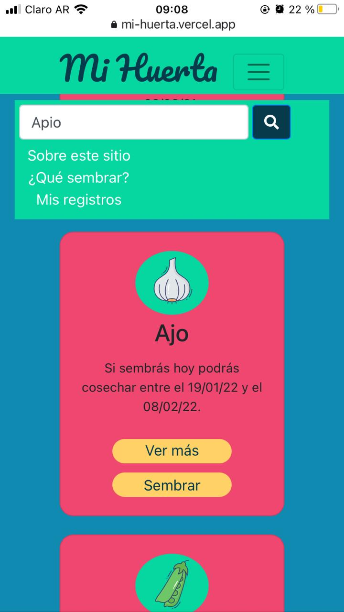
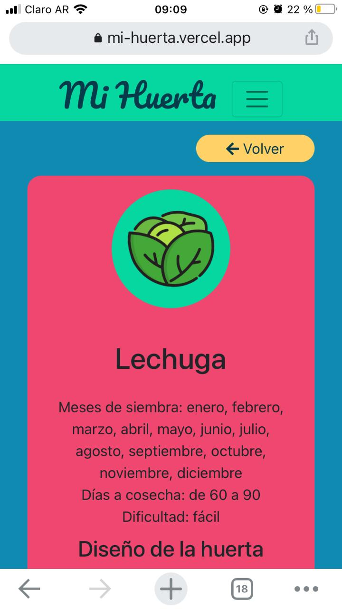

Website for home vegetable gardening. This project was developed by a very junior developer for learning React, so all feedback is welcome :).

It was created with Create Reaact App, and it uses several features: SASS, api context, useReducer, localStorage and react router, among others. It´s still a work in progress, although it´s currently stand by so I can focus in other projects.

TODOS:
 - Full accesibility review and adjustments,
 - Login and authentication,
 - Backend for uploading growing sowing photos and sharing sowing records with other users,
 - Further filters,
 - Diagrams for sowing planning, according to available user garden space. 

Demo: https://mi-huerta.vercel.app/
Notes about what Mi Huerta means to me (in Spanish): https://www.notion.so/Notas-sobre-el-proceso-de-Mi-Huerta-d2e9331e2ce744a6a6817a36bf61c25a